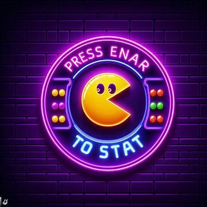
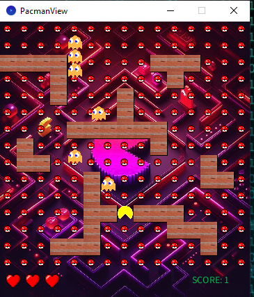

# Projektname

## Kurzbeschreibung

Pacman ist ein klassisches Arcade-Spiel, das in den 1980er Jahren populär wurde. In diesem Programm wird eine digitale Version des Pacman-Spiels erstellt.

Der Spieler steuert Pacman, eine runde Figur, die durch ein Labyrinth voller Punkte navigieren muss. Das Ziel ist es, alle Punkte zu fressen, während Geister versuchen, Pacman zu fangen.

## Inhaltsverzeichnis

1. [Verwendete Quellen](#verwendete-quellen)
2. [Programm starten](#programm-starten)
3. [Starteinstellungen](#starteinstellungen)
4. [Beispiel in der JShell](#beispiel-in-der-jshell)
5. [Screenshots](#screenshots)


## Verwendete Quellen
- # core.jar:
  - Processing-Bibliothek (processing.core.PApplet & processing.core.PImage)
  - Java-Bibliothek java.util.Arrays
- Minim Library:
  - ddf.minim.*

## Programm starten

1. Öffnen Sie IntelliJ:  
   Starten Sie IntelliJ IDEA und öffnen Sie Ihr Pacman-Projekt.

2. Klicken Sie auf Run > PacmanMain

## Starteinstellungen

- Klicken Sie auf das Spiel-Fenster und dann drücken Sie die Leertaste, um das Spiel zu beginnen.
- Drücken Sie die ENTER, um das Spiel zu pausieren.
- Verwenden Sie die Pfeile, um sich zu bewegen 
  - Pfeil oben, um nach oben zu gehen
  - Pfeil nach unten, um nach unten zu gehen
  -  Pfeil nach rechts, um nach rechts zu gehen
  -  Pfeil nach links, um nach links zu gehen

## screenshots
StartSeite

Spiel:

- blaue sind Ghost
- rot ist die Leben
- green ist der Score
- yellow ist der Spieler
- und die kleine Poke-ball sind das wu fressendes Essen
  
## Beispiel in der JShell

Um das Modell in der JShell zu testen, können Sie folgende Schritte befolgen:

```java

jshell --class-path ./out/production/ProjektKingsley/pacmangame/model/

//Laden Sie die PacmanModel-Klasse:
/open PacmanModel.java

// Erstellen Sie eine Instanz von PacmanModel
PacmanModel game = new PacmanModel();

// Initialisieren Sie das Spiel (um die initiale Position von Pac-Man festzulegen)
game.initGame();

// Holen Sie sich die Koordinaten von Pac-Man
game.getPacman_x();
game.getPacman_y();

// Zeigen Sie die Koordinaten von Pac-Man in der Konsole an
System.out.println("Position von Pac-Man nach der Initialisierung: (" + game.getPacman_x() + ", " + game.getPacman_y() + ")");

// Bewegen Sie Pac-Man nach links
game.setReq_dx(-1);
game.setReq_dy(0);
game.movePacman(-1, 0);

// Bewegen Sie Pac-Man nach rechts
game.setReq_dx(1);
game.setReq_dy(0);
game.movePacman(1, 0);

// Bewegen Sie Pac-Man nach oben
game.setReq_dx(0);
game.setReq_dy(-1);
game.movePacman(0, -1);

// Bewegen Sie Pac-Man nach unter
game.setReq_dx(0);
game.setReq_dy(1);
game.movePacman(0, 1);

// Die Koordinaten von Pacman nach der Bewgung anzeigen
System.out.println("Position von pacman nach der Bewegung : (" + game.getPacman_x() + ", " + game.getPacman_y() + ")");

// Position von Pacman setzen
game.setPacman_x(94);
game.setPacman_y(94);

//neu position von pacman
System.out.println("neue Position von pacman nach der Sprung : (" + game.getPacman_x() + ", " + game.getPacman_y() + ")");


//prufen, ob pacman gestorrben ist nach der kollision
if (game.isDying()) {
    System.out.println("Collision détectée ! Pacman est en train de mourir.");
} else {
    System.out.println("Pas de collision détectée.");
}


// Überprüfen Sie die Kollision
game.collision();


game.collision();

// Überprüfen Sie, ob Pac-Man stirbt
boolean isDying = game.isDying();
System.out.println("Pac-Man stirbt gerade: " + isDying);

// Holen Sie sich die Positionen der Geister
int[] ghostX = game.getGhost_x();
int[] ghostY = game.getGhost_y();

// Zeigen Sie die Positionen der Geister in der Konsole an
System.out.println("Positionen der Geister: (" + Arrays.toString(ghostX) + ", " + Arrays.toString(ghostY) + ")");

// Ändern Sie die Geschwindigkeit des Spiels
game.setCurrentSpeed(4); // Setzen Sie die Geschwindigkeit auf 4 (Beispielwert)

// Pausieren Sie das Spiel
game.setPaused(true);

// Überprüfen Sie, ob das Spiel pausiert ist

boolean isPaused = pacmanModel.getPaused();
System.out.println("Spiel pausiert: " + isPaused)

// Fortsetzen des Spiels

game.setPaused(false);

// Überprüfen Sie, ob das Spiel läuft
boolean isInGame = game.isInGame();
System.out.println("Spiel läuft: " + isInGame);

// Ändern Sie die Anzahl der Leben auf 5 (Beispielwert)
pacmanModel.setLives(5);

// Ändern Sie die Anzahl der Geister auf 10 (Beispielwert)
pacmanModel.setN_GHOSTS(10);

// Ändern Sie die Punktzahl auf 100 (Beispielwert)
pacmanModel.setScore(100);
